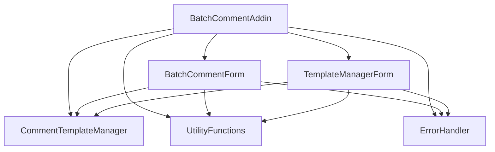

# API 文档

本文档描述了Excel批量批注插件的内部API结构，供开发者参考和扩展。

## 目录

- [架构概览](#架构概览)
- [核心模块](#核心模块)
- [数据结构](#数据结构)
- [公共接口](#公共接口)
- [事件系统](#事件系统)
- [扩展开发](#扩展开发)

## 架构概览

### 模块结构

```
BatchCommentAddin
├── BatchCommentAddin.bas          # 主模块，插件生命周期管理
├── CommentTemplateManager.bas     # 模板管理器
├── UtilityFunctions.bas           # 工具函数集合
├── ErrorHandler.bas               # 错误处理模块
├── BatchCommentForm.frm           # 主界面窗体
└── TemplateManagerForm.frm        # 模板管理界面
```

### 依赖关系



## 核心模块

### BatchCommentAddin.bas

主模块，负责插件的生命周期管理和核心功能入口。

#### 公共常量

```vb
Public Const ADDIN_NAME As String = "批量批注助手"
Public Const ADDIN_VERSION As String = "1.0.0"
Public Const ADDIN_AUTHOR As String = "OneDay Team"
Public Const CONFIG_PATH As String = "\BatchCommentAddin\"
```

#### 全局变量

```vb
Public g_IsInitialized As Boolean      ' 插件是否已初始化
Public g_ConfigPath As String          ' 配置文件路径
Public g_LogPath As String             ' 日志文件路径
```

#### 主要函数

##### Auto_Open()
```vb
Public Sub Auto_Open()
```
- **功能**：插件启动时自动调用
- **参数**：无
- **返回值**：无
- **说明**：初始化插件，创建用户界面，记录启动日志

##### Auto_Close()
```vb
Public Sub Auto_Close()
```
- **功能**：插件关闭时自动调用
- **参数**：无
- **返回值**：无
- **说明**：保存用户设置，清理资源，记录关闭日志

##### ShowBatchCommentDialog()
```vb
Public Sub ShowBatchCommentDialog()
```
- **功能**：显示批量批注对话框
- **参数**：无
- **返回值**：无
- **说明**：主要功能入口，检查Excel状态后显示主界面

##### ShowTemplateManager()
```vb
Public Sub ShowTemplateManager()
```
- **功能**：显示模板管理器
- **参数**：无
- **返回值**：无
- **说明**：打开模板管理界面

### CommentTemplateManager.bas

模板管理器，负责批注模板的创建、存储、管理。

#### 数据结构

##### CommentTemplate
```vb
Public Type CommentTemplate
    Name As String              ' 模板名称
    FontName As String          ' 字体名称
    FontSize As Integer         ' 字体大小
    FontColor As Long           ' 字体颜色
    IsBold As Boolean           ' 是否粗体
    IsItalic As Boolean         ' 是否斜体
    DefaultText As String       ' 默认文本
    BackgroundColor As Long     ' 背景颜色
    Width As Integer            ' 宽度
    Height As Integer           ' 高度
    IsAutoSize As Boolean       ' 是否自动调整大小
End Type
```

#### 主要函数

##### InitializeTemplateManager()
```vb
Public Sub InitializeTemplateManager()
```
- **功能**：初始化模板管理器
- **参数**：无
- **返回值**：无
- **说明**：加载默认模板和用户自定义模板

##### AddTemplate()
```vb
Public Function AddTemplate(templateName As String, fontName As String, fontSize As Integer, _
                           fontColor As Long, isBold As Boolean, isItalic As Boolean, _
                           defaultText As String, backgroundColor As Long, _
                           width As Integer, height As Integer, isAutoSize As Boolean) As Boolean
```
- **功能**：添加新模板
- **参数**：模板的各项属性
- **返回值**：Boolean - 是否添加成功
- **说明**：检查模板名称唯一性，添加到模板集合

##### GetTemplate()
```vb
Public Function GetTemplate(templateName As String) As CommentTemplate
```
- **功能**：获取指定模板
- **参数**：templateName - 模板名称
- **返回值**：CommentTemplate - 模板对象
- **说明**：根据名称查找并返回模板

##### GetTemplateNames()
```vb
Public Function GetTemplateNames() As String()
```
- **功能**：获取所有模板名称
- **参数**：无
- **返回值**：String() - 模板名称数组
- **说明**：返回当前所有可用模板的名称列表

### UtilityFunctions.bas

工具函数集合，提供各种辅助功能。

#### 字符串处理

##### SafeTrim()
```vb
Public Function SafeTrim(inputStr As Variant) As String
```
- **功能**：安全的字符串修剪
- **参数**：inputStr - 输入字符串（可为空）
- **返回值**：String - 修剪后的字符串
- **说明**：处理空值和空字符串，返回修剪后的结果

##### ReplacePlaceholders()
```vb
Public Function ReplacePlaceholders(text As String, cell As Range) As String
```
- **功能**：替换文本中的占位符
- **参数**：text - 包含占位符的文本，cell - 目标单元格
- **返回值**：String - 替换后的文本
- **说明**：将占位符替换为实际值

#### 区域处理

##### IsValidRange()
```vb
Public Function IsValidRange(rangeAddress As String) As Boolean
```
- **功能**：验证区域地址是否有效
- **参数**：rangeAddress - 区域地址字符串
- **返回值**：Boolean - 是否有效
- **说明**：检查区域地址格式的正确性

##### GetRangeCellCount()
```vb
Public Function GetRangeCellCount(rangeAddress As String) As Long
```
- **功能**：获取区域中的单元格数量
- **参数**：rangeAddress - 区域地址
- **返回值**：Long - 单元格数量
- **说明**：计算指定区域包含的单元格总数

#### 文件处理

##### LoadCommentFromFile()
```vb
Public Function LoadCommentFromFile(filePath As String) As Variant
```
- **功能**：从文件加载批注数据
- **参数**：filePath - 文件路径
- **返回值**：Variant - 批注数据（字符串或数组）
- **说明**：根据文件类型自动选择加载方式

### ErrorHandler.bas

错误处理模块，提供统一的错误处理机制。

#### 错误类型枚举

```vb
Public Enum ErrorType
    etGeneral = 0           ' 一般错误
    etFileAccess = 1        ' 文件访问错误
    etRangeError = 2        ' 区域错误
    etDataValidation = 3    ' 数据验证错误
    etTemplateError = 4     ' 模板错误
    etUserInterface = 5     ' 用户界面错误
    etSystemError = 6       ' 系统错误
End Enum
```

#### 错误信息结构

```vb
Public Type ErrorInfo
    ErrorType As ErrorType      ' 错误类型
    ErrorNumber As Long         ' 错误编号
    ErrorDescription As String  ' 错误描述
    ModuleName As String        ' 模块名称
    ProcedureName As String     ' 过程名称
    Timestamp As Date           ' 时间戳
    UserAction As String        ' 用户操作
    SystemInfo As String        ' 系统信息
End Type
```

#### 主要函数

##### HandleError()
```vb
Public Sub HandleError(errorType As ErrorType, errorNumber As Long, errorDescription As String, _
                      moduleName As String, procedureName As String, Optional userAction As String = "")
```
- **功能**：处理错误的主函数
- **参数**：错误类型、编号、描述、模块名、过程名、用户操作
- **返回值**：无
- **说明**：记录错误、显示错误信息、执行恢复操作

## 数据结构

### 配置数据

#### 用户设置
```vb
Type UserSettings
    DefaultFontName As String
    DefaultFontSize As Integer
    DefaultFontColor As Long
    AutoBackup As Boolean
    ShowProgress As Boolean
    MaxCellsPerBatch As Long
End Type
```

#### 操作历史
```vb
Type OperationHistory
    Timestamp As Date
    OperationType As String
    TargetRange As String
    CellCount As Long
    Success As Boolean
    ErrorMessage As String
End Type
```

## 公共接口

### 批注操作接口

#### IBatchCommentProcessor
```vb
' 批量批注处理器接口（概念性）
Public Interface IBatchCommentProcessor
    Function ProcessComments(targetRange As Range, sourceData As Variant, template As CommentTemplate) As Boolean
    Function ValidateInput(targetRange As String, sourceData As Variant) As Boolean
    Sub ShowProgress(current As Long, total As Long)
End Interface
```

### 模板管理接口

#### ITemplateManager
```vb
' 模板管理器接口（概念性）
Public Interface ITemplateManager
    Function AddTemplate(template As CommentTemplate) As Boolean
    Function UpdateTemplate(oldName As String, newTemplate As CommentTemplate) As Boolean
    Function DeleteTemplate(templateName As String) As Boolean
    Function GetTemplate(templateName As String) As CommentTemplate
    Function ExportTemplate(templateName As String, filePath As String) As Boolean
    Function ImportTemplate(filePath As String) As Boolean
End Interface
```

## 事件系统

### 事件类型

#### 插件事件
- **AddinStartup**：插件启动
- **AddinShutdown**：插件关闭
- **AddinError**：插件错误

#### 操作事件
- **BatchCommentStart**：批量批注开始
- **BatchCommentProgress**：批量批注进度更新
- **BatchCommentComplete**：批量批注完成
- **BatchCommentCancel**：批量批注取消

#### 模板事件
- **TemplateCreated**：模板创建
- **TemplateUpdated**：模板更新
- **TemplateDeleted**：模板删除

### 事件处理

```vb
' 事件处理示例
Private Sub OnBatchCommentProgress(current As Long, total As Long)
    ' 更新进度显示
    UpdateProgressBar current, total
    
    ' 记录进度日志
    LogOperation "PROGRESS", "处理进度: " & current & "/" & total
End Sub
```

## 扩展开发

### 添加新的数据源类型

1. **扩展数据源枚举**
```vb
Public Enum CommentSourceType
    cstCell = 0
    cstFixedText = 1
    cstFile = 2
    cstDatabase = 3     ' 新增：数据库
    cstWebService = 4   ' 新增：Web服务
End Enum
```

2. **实现数据加载函数**
```vb
Private Function LoadFromDatabase(connectionString As String, query As String) As Variant
    ' 实现数据库数据加载逻辑
End Function
```

3. **更新用户界面**
   - 在BatchCommentForm中添加新的选项按钮
   - 添加相应的配置控件

### 添加新的占位符

1. **扩展占位符处理函数**
```vb
Public Function ReplacePlaceholders(text As String, cell As Range) As String
    Dim result As String
    result = text
    
    ' 现有占位符处理...
    
    ' 新增占位符
    result = Replace(result, "{FORMULA}", cell.Formula)
    result = Replace(result, "{COMMENT}", IIf(cell.Comment Is Nothing, "", cell.Comment.Text))
    
    ReplacePlaceholders = result
End Function
```

### 添加新的模板属性

1. **扩展CommentTemplate结构**
```vb
Public Type CommentTemplate
    ' 现有属性...
    
    ' 新增属性
    BorderStyle As Integer
    BorderColor As Long
    Transparency As Single
End Type
```

2. **更新模板管理函数**
   - 修改AddTemplate函数参数
   - 更新模板保存/加载逻辑
   - 扩展模板管理界面

### 自定义错误处理

```vb
' 自定义错误处理器
Public Sub CustomErrorHandler(errorInfo As ErrorInfo)
    ' 发送错误报告到服务器
    SendErrorReport errorInfo
    
    ' 自定义错误恢复逻辑
    Select Case errorInfo.ErrorType
        Case etCustomError
            ' 自定义错误处理
    End Select
End Sub
```

## 性能优化建议

### 大数据处理

1. **分批处理**
```vb
Private Sub ProcessLargeDataset(targetRange As Range, sourceData As Variant)
    Const BATCH_SIZE As Long = 1000
    
    Dim totalCells As Long
    totalCells = targetRange.Cells.Count
    
    Dim i As Long
    For i = 1 To totalCells Step BATCH_SIZE
        Dim batchEnd As Long
        batchEnd = Application.Min(i + BATCH_SIZE - 1, totalCells)
        
        ' 处理当前批次
        ProcessBatch targetRange.Cells(i), batchEnd - i + 1
        
        ' 更新进度
        UpdateProgress i + BATCH_SIZE - 1, totalCells
        
        ' 允许用户取消
        DoEvents
        If m_cancelled Then Exit For
    Next i
End Sub
```

2. **内存管理**
```vb
Private Sub OptimizeMemoryUsage()
    ' 禁用屏幕更新
    Application.ScreenUpdating = False
    
    ' 禁用自动计算
    Application.Calculation = xlCalculationManual
    
    ' 处理完成后恢复
    Application.ScreenUpdating = True
    Application.Calculation = xlCalculationAutomatic
End Sub
```

## 调试和测试

### 调试模式

```vb
' 启用调试模式
Public Sub EnableDebugMode()
    ' 创建调试标志文件
    Dim debugFile As String
    debugFile = g_ConfigPath & "debug.flag"
    
    Open debugFile For Output As #1
    Print #1, "Debug mode enabled at " & Now
    Close #1
End Sub
```

### 单元测试框架

```vb
' 简单的测试框架
Public Sub RunTests()
    Dim testResults As Collection
    Set testResults = New Collection
    
    ' 运行各项测试
    testResults.Add TestStringFunctions()
    testResults.Add TestRangeFunctions()
    testResults.Add TestTemplateFunctions()
    
    ' 输出测试结果
    OutputTestResults testResults
End Sub
```

## 版本兼容性

### API版本控制

```vb
Public Const API_VERSION As String = "1.0"

Public Function GetAPIVersion() As String
    GetAPIVersion = API_VERSION
End Function

Public Function IsAPICompatible(requiredVersion As String) As Boolean
    ' 检查API兼容性
    IsAPICompatible = (API_VERSION >= requiredVersion)
End Function
```

### 向后兼容性

在添加新功能时，确保：
1. 保持现有函数签名不变
2. 新增可选参数而不是修改必需参数
3. 提供迁移工具处理旧版本数据

---

本API文档将随着插件的更新而持续维护。如有疑问或建议，请访问 [GitHub Issues](https://github.com/yourusername/BatchCommentAddin/issues)。